<div align="center">

<!-- Typing banner -->


</div>

```
  Al Mamud Bijoy
  ---------------------------------------------------------
  Role       ->  Web Developer @ Betopia Limited
  Domain     ->  Frontend | Web Apps | UI Engineering | Full Stack
  Stack      ->  React | Tailwind CSS | JavaScript | TypeScript | Node.js
  Currently  ->  Learning TypeScript
  Status     ->  building clean, useful web experiences.
```

---

### How I think

I like building interfaces that feel simple on the surface and solid underneath. My work usually starts with the same question: what would make this easier, clearer, and more useful for the person using it?

I come from a computer science engineering background, and web development is where that curiosity turned into craft. React and Tailwind CSS are my everyday tools, but I keep pushing into TypeScript, backend fundamentals, and better product thinking so the whole experience holds together.

When I am not coding, I am usually refining my setup, exploring new tools, or following the kind of tech ideas that make me want to open the editor again.

---

### What I'm working with

<div align="center">

</div>

<table>
  <tr>
    <td><b>Frontend</b></td>
    <td>
      
      
      
      
      
      
      
      
    </td>
  </tr>
  <tr>
    <td><b>Backend</b></td>
    <td>
      
      
      
    </td>
  </tr>
  <tr>
    <td><b>Data / Cloud</b></td>
    <td>
      
      
    </td>
  </tr>
  <tr>
    <td><b>Design / Tools</b></td>
    <td>
      
      
      
    </td>
  </tr>
  <tr>
    <td><b>Foundations</b></td>
    <td>
      
      
    </td>
  </tr>
</table>

---

### Currently building

```
  [WORK]     Web products at Betopia Limited.
  [LEARNING] TypeScript and stronger frontend architecture.
  [FOCUS]    React, Tailwind CSS, responsive UI, and useful product flows.
  [NEXT]     More polished full-stack projects for the portfolio.
```

---

### Activity

<div align="center">


</div>

---

### Find me

<p align="center">
  <a href="https://almamudbijoy-portfolio.vercel.app/">
    
  </a>
  &nbsp;
  <a href="https://www.linkedin.com/in/almamudbijoy09/">
    
  </a>
  &nbsp;
  <a href="https://www.facebook.com/ip.bjoy">
    
  </a>
  &nbsp;
  <a href="https://drive.google.com/file/d/1HpEGKnuhYcPGo_d2AaMpGwy3HTXO30hQ/view?usp=sharing">
    
  </a>
  &nbsp;
  <a href="mailto:bijoymamud.09@gmail.com">
    
  </a>
</p>

<div align="center">
<sub>open to collaborations on React, Tailwind CSS, and practical web products</sub>
</div>
